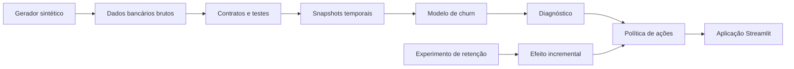

# Pulso — Diagnóstico de Churn e Próxima Melhor Ação

> Um produto analítico completo para um banco digital fictício: prevê perda de relacionamento em 60 dias, diagnostica causas prováveis e recomenda a ação economicamente mais adequada para cada cliente.


## O problema de negócio

Em um banco digital, encerrar formalmente a conta não é o único churn relevante. Muitos clientes mantêm a conta aberta, mas deixam de receber salário, fazer Pix, pagar contas ou usar o cartão. O projeto define churn como **60 dias sem atividade financeira qualificante**, com horizonte prospectivo de dois meses.

O produto responde a cinco perguntas:

1. Quem tem maior probabilidade de perder relacionamento?
2. Quais sinais explicam o risco?
3. Quanto valor financeiro está em risco?
4. Qual ação possui evidência de retenção incremental para aquele contexto?
5. Vale a pena agir depois de considerar custo, consentimento e pressão de contato?

## Por que este projeto é mais do que um modelo

- alvo definido em linguagem operacional;
- snapshots temporais sem informação futura;
- variável de inatividade atual mantida no diagnóstico, mas excluída do modelo para evitar um atalho conceitual para o alvo;
- baseline e modelo desafiante;
- avaliação por PR-AUC, lift, recall com capacidade fixa, Brier e PSI;
- diagnóstico separado da previsão;
- experimento aleatório sintético com grupo de controle;
- recomendação por valor incremental líquido;
- restrições de consentimento, elegibilidade e saturação de contato;
- testes de dados, documentação e automação;
- aplicação executiva e operacional;
- atributos sensíveis não usados na decisão.

## Arquitetura



## Dados sintéticos

A execução completa gera aproximadamente:

- 50 mil clientes;
- 24 meses de comportamento;
- cerca de 1,1 milhão de registros mensais;
- Pix, cartão, pagamentos, saldo e acessos;
- falhas transacionais e contatos de marketing;
- chamados, pendências e NPS;
- produtos, margem e consentimento;
- experimento de retenção com cinco braços.

Nenhum registro pertence a uma pessoa real. A base é determinística e pode ser recriada com a mesma semente aleatória.

## Resultado da demonstração sintética

Na execução reproduzível com 50 mil clientes:

| Indicador | Resultado |
|---|---:|
| PR-AUC no teste temporal | 0,898 |
| ROC-AUC no teste temporal | 0,945 |
| Recall dentro do top 10% | 87,2% |
| Lift dentro do top 10% | 8,72x |
| Clientes com ação economicamente elegível | 1.907 |
| Valor anual em risco alto/crítico | R$ 481,7 mil |
| Valor líquido esperado da política | R$ 26,4 mil |

Os valores financeiros são estimativas de uma simulação. Não representam impacto obtido em empresa real.

## Fórmula da decisão

```text
valor líquido esperado =
probabilidade de churn
× retenção incremental estimada da ação
× valor anual do cliente
− custo da ação
```

Alto risco não implica contato automático. Uma ação pode ser rejeitada por:

- valor esperado negativo;
- ausência de consentimento;
- excesso de contatos recentes;
- falta de elegibilidade;
- evidência experimental insuficiente.

## Execução rápida no GitHub Codespaces

```bash
python -m venv .venv
source .venv/bin/activate
pip install -r requirements-dev.txt
python -m src.run_pipeline --customers 50000
streamlit run app.py
```

Para uma validação rápida, use 5 mil clientes:

```bash
python -m src.run_pipeline --customers 5000
```

## Camada SQL e dbt

Depois de gerar os dados:

```bash
dbt build --project-dir dbt --profiles-dir dbt
dbt docs generate --project-dir dbt --profiles-dir dbt
dbt docs serve --project-dir dbt --profiles-dir dbt
```

## Estrutura

```text
bank-retention-intelligence/
├── app.py
├── requirements.txt
├── src/
│   ├── generate_data.py
│   ├── validate_data.py
│   ├── build_features.py
│   ├── train_model.py
│   ├── recommend_actions.py
│   └── run_pipeline.py
├── dbt/
│   ├── models/
│   └── tests/
├── sql/
├── tests/
├── docs/
├── data/
├── models/
└── outputs/
```

## Aplicação

A aplicação possui seis áreas:

1. visão executiva;
2. diagnóstico de causas;
3. desempenho do modelo;
4. próxima melhor ação;
5. cliente 360;
6. governança e monitoramento.

## Limitações

- Todos os impactos financeiros são estimativas simuladas.
- A causa atribuída é uma hipótese analítica, não uma verdade individual.
- O efeito das ações vem de um experimento sintético, não de uma campanha real.
- “Avaliar limite” não significa aprovar crédito; a decisão de crédito exige política e modelo independentes.
- O projeto não deve ser usado para tomar decisões sobre clientes reais.

## Guia completo

Leia [docs/GUIA_CLIQUE_A_CLIQUE.md](docs/GUIA_CLIQUE_A_CLIQUE.md) para executar o projeto desde a criação da conta no GitHub até a publicação da aplicação.
