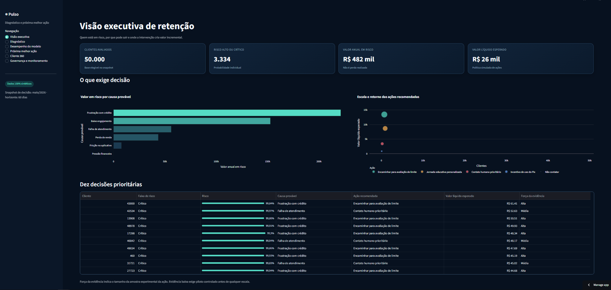
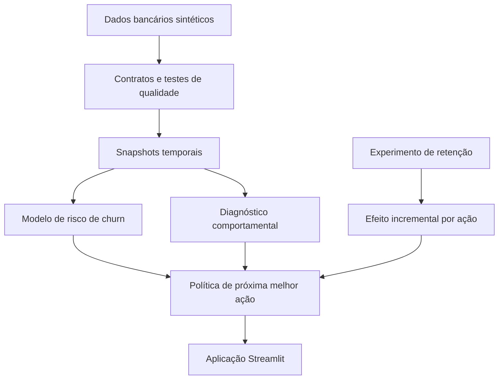
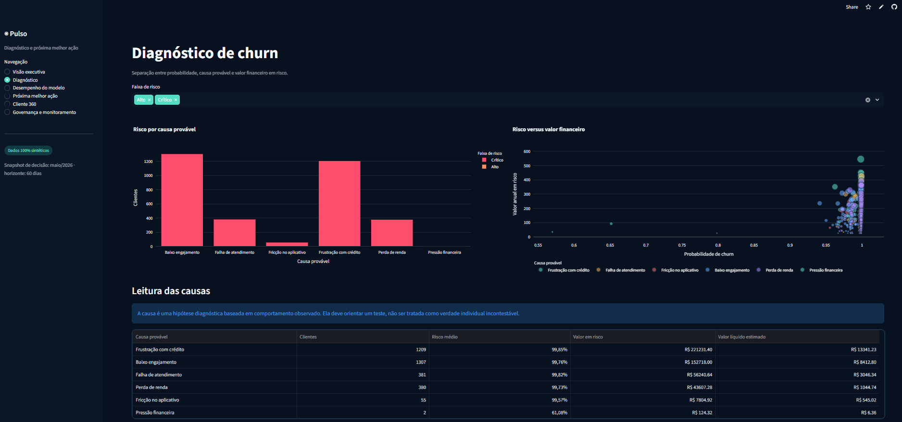
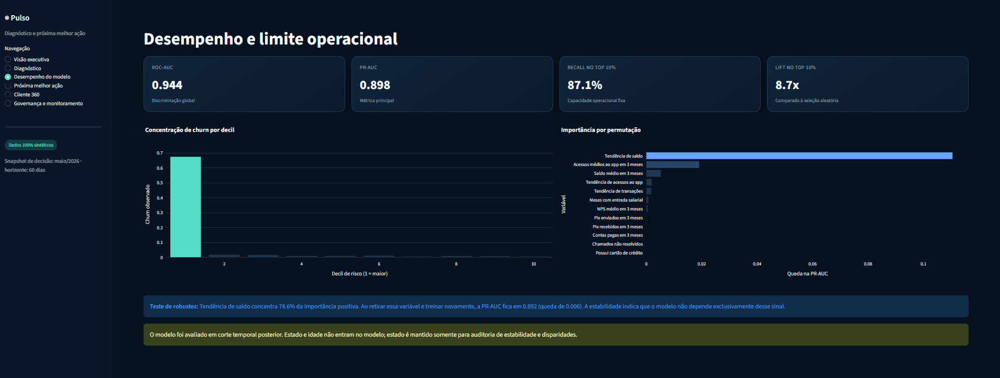
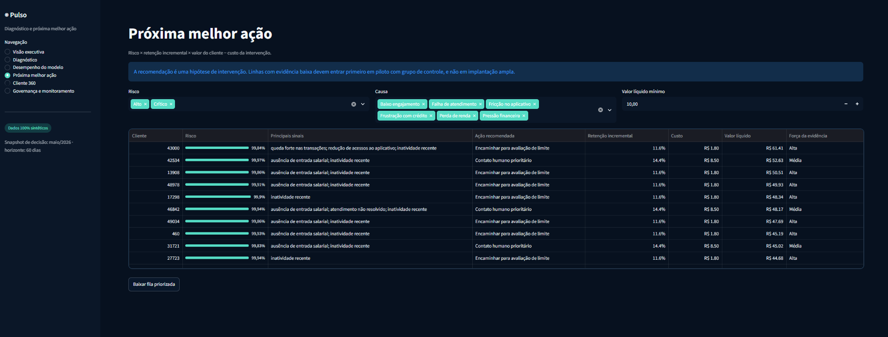
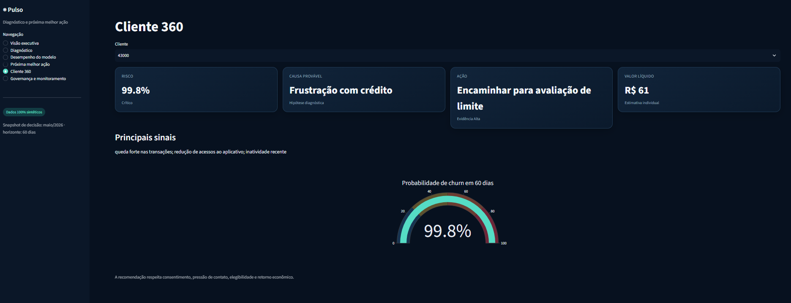
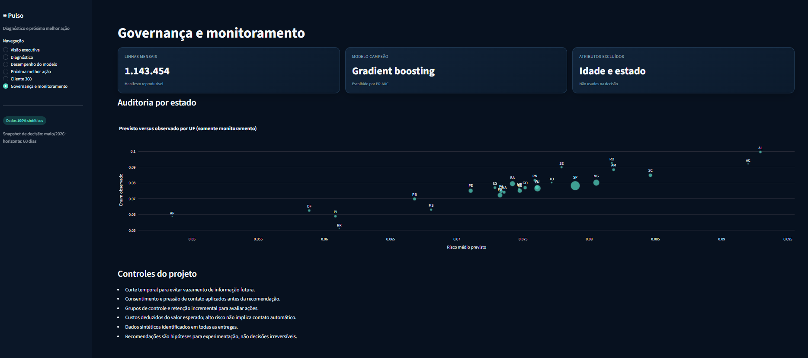

# Pulso — Inteligência de Retenção para Banco Digital

> Produto analítico de ponta a ponta que estima risco de perda de relacionamento em 60 dias, diagnostica sinais prováveis e recomenda a próxima melhor ação com base em efeito incremental, valor econômico e restrições de contato.

[](https://github.com/WeegorMartins/bank-retention-intelligence/actions/workflows/quality.yml)


**[Abrir a aplicação](https://pulso-retencao-inteligente.streamlit.app/)** · **[Ler o memorando executivo](docs/MEMORANDO_EXECUTIVO.md)** · **[Ver o guia de execução](docs/GUIA_CLIQUE_A_CLIQUE.md)**



## Resumo executivo

Em banco digital, uma conta aberta não significa relacionamento ativo. O cliente pode deixar de receber salário, fazer Pix, pagar contas e usar o cartão sem encerrar formalmente a conta.

O Pulso transforma esse problema em uma decisão operacional:

1. quem apresenta maior risco de perder relacionamento;
2. quais sinais comportamentais sustentam o diagnóstico;
3. quanto valor anual está exposto;
4. qual ação apresentou retenção incremental em clientes semelhantes;
5. quando **não agir** por custo, consentimento, saturação ou baixa evidência.

### Resultado da simulação reproduzível

| Indicador | Resultado |
|---|---:|
| Clientes avaliados | 50.000 |
| Clientes em risco alto ou crítico | 3.334 |
| Clientes com ação economicamente elegível | 1.907 |
| Valor anual em risco alto/crítico | R$ 481,7 mil |
| Valor líquido esperado da política | R$ 26,4 mil |
| PR-AUC no teste temporal | 0,898 |
| ROC-AUC no teste temporal | 0,944 |
| Recall dentro dos 10% priorizados | 87,1% |
| Lift dentro dos 10% priorizados | 8,7x |

Os valores financeiros são estimativas de uma simulação e não representam impacto obtido em uma empresa real.

## O que demonstra senioridade neste projeto

| Decisão | Como foi tratada |
|---|---|
| Definição de churn | Perda de relacionamento: 60 dias sem atividade financeira qualificante, e não apenas conta encerrada. |
| Vazamento de dados futuros | Variáveis construídas em snapshots mensais; o período futuro é usado somente para formar o alvo. |
| Atalho conceitual | Dias desde a última atividade permanece no diagnóstico, mas foi excluído do modelo de decisão. |
| Modelo de referência | Regressão logística comparada com um modelo desafiante de gradiente. |
| Métrica principal | PR-AUC, complementada por Brier, PSI, lift e recall dentro de capacidade operacional fixa. |
| Diagnóstico versus causa | O segmento é apresentado como hipótese diagnóstica, não como causa individual comprovada. |
| Recomendação | Risco × retenção incremental × valor do cliente − custo da intervenção. |
| Disciplina causal | Efeitos estimados a partir de experimento sintético aleatório com grupo de controle. |
| Governança | Consentimento, pressão de contato, elegibilidade, força da evidência e auditoria por UF. |
| Atributos protegidos | Idade e estado não entram no modelo; estado é mantido apenas para monitoramento. |

## Arquitetura da solução



### Camadas

- **Dados:** clientes, atividade mensal, atendimento e experimento de retenção.
- **Transformação:** Python, SQL, DuckDB e dbt para contratos, testes e snapshots.
- **Modelagem:** referência logística, desafiante de gradiente e avaliação temporal.
- **Decisão:** diagnóstico, efeito incremental, valor líquido e regras de elegibilidade.
- **Consumo:** visão executiva, fila priorizada, cliente 360 e monitoramento.

## Dados e definição do alvo

A geração completa cria aproximadamente:

- 50 mil clientes e 24 meses de comportamento;
- 1,14 milhão de registros mensais;
- Pix, cartão, pagamentos, saldos e acessos ao aplicativo;
- falhas transacionais, contatos, chamados, pendências e NPS;
- produtos, margem, consentimento e pressão de contato;
- experimento de retenção com cinco braços.

O alvo `churn_60d` vale 1 quando, nos dois meses posteriores ao snapshot, o cliente chega a 60 dias sem atividade financeira qualificante e realiza no máximo uma transação. Nenhum registro pertence a uma pessoa real.

O dicionário completo está em [docs/DICIONARIO_DE_DADOS.md](docs/DICIONARIO_DE_DADOS.md).

## Da previsão à decisão

O escore de churn não determina contato automaticamente. Para cada combinação de segmento e ação, a política calcula:

```text
valor líquido esperado =
probabilidade de churn
× retenção incremental estimada da ação
× valor anual do cliente
− custo da ação
```

A ação ainda pode ser bloqueada por:

- retorno esperado negativo;
- ausência de consentimento;
- excesso de contatos recentes;
- falta de elegibilidade;
- evidência experimental insuficiente.

Essa separação evita transformar “alto risco” em campanha indiscriminada.

## Aplicação interativa

A aplicação possui seis áreas:

1. **Visão executiva:** tamanho do risco, valor exposto e decisões prioritárias.
2. **Diagnóstico:** distribuição de risco, hipóteses de causa e valor financeiro.
3. **Desempenho do modelo:** métricas, concentração por decil e importância por permutação.
4. **Próxima melhor ação:** fila filtrável e disponível para download.
5. **Cliente 360:** risco, sinais, recomendação e retorno esperado por cliente.
6. **Governança e monitoramento:** linhagem, atributos excluídos e auditoria por estado.

<details>
<summary><strong>Ver as outras telas do produto</strong></summary>

### Diagnóstico de churn



### Desempenho e limite operacional



### Próxima melhor ação



### Cliente 360



### Governança e monitoramento



</details>

## Como reproduzir gratuitamente

O projeto pode ser executado integralmente no GitHub Codespaces.

```bash
python -m venv .venv
source .venv/bin/activate
python -m pip install --upgrade pip
pip install -r requirements-dev.txt
python -m src.run_pipeline --customers 50000
pytest -q
streamlit run app.py
```

Para validar o fluxo com menor tempo de execução:

```bash
python -m src.run_pipeline --customers 5000
```

### Camada SQL e dbt

Depois da geração dos dados:

```bash
dbt build --project-dir dbt --profiles-dir dbt
dbt docs generate --project-dir dbt --profiles-dir dbt
dbt docs serve --project-dir dbt --profiles-dir dbt
```

## Estrutura do repositório

```text
bank-retention-intelligence/
├── app.py                    # aplicação analítica
├── src/                      # geração, validação, atributos, modelo e decisão
├── dbt/                      # modelos, contratos e testes SQL
├── sql/                      # consultas de negócio
├── tests/                    # testes automatizados
├── outputs/                  # artefatos reproduzíveis consumidos pela aplicação
├── docs/                     # documentação executiva e técnica
├── requirements.txt          # dependências da aplicação
└── requirements-dev.txt      # dependências do desenvolvimento
```

## Qualidade, governança e limitações

- corte temporal posterior para avaliação fora da amostra;
- contratos, testes unitários e validações de qualidade;
- comparação entre modelo de referência e desafiante;
- teste de robustez retirando a variável mais importante e treinando novamente;
- monitoramento de estabilidade do escore e auditoria geográfica;
- consentimento e pressão de contato aplicados antes da recomendação;
- grupos de controle preservados para mensuração incremental;
- dados sintéticos identificados em todas as entregas.

Limitações essenciais:

- a causa provável é uma hipótese analítica, não uma verdade individual;
- o efeito das ações vem de experimento sintético, não de campanha real;
- “avaliar limite” não significa aprovar crédito;
- recomendações de baixa evidência devem começar em piloto controlado;
- o protótipo não deve ser usado para decisões sobre clientes reais.

## Documentação

- [Memorando executivo](docs/MEMORANDO_EXECUTIVO.md)
- [Como apresentar em entrevista](docs/COMO_APRESENTAR_EM_ENTREVISTA.md)
- [Dicionário de dados](docs/DICIONARIO_DE_DADOS.md)
- [Guia completo, clique a clique](docs/GUIA_CLIQUE_A_CLIQUE.md)
- [Roteiro de publicação no LinkedIn](docs/ROTEIRO_LINKEDIN.md)

## Autor

**Weegor Martins** — análise de dados, inteligência de clientes e produtos analíticos para decisão.

[Perfil no GitHub](https://github.com/WeegorMartins)

---

Este repositório é um projeto de portfólio com dados 100% sintéticos. O objetivo é demonstrar raciocínio analítico, engenharia de dados, modelagem, experimentação, comunicação executiva e governança aplicadas a retenção em serviços financeiros.
